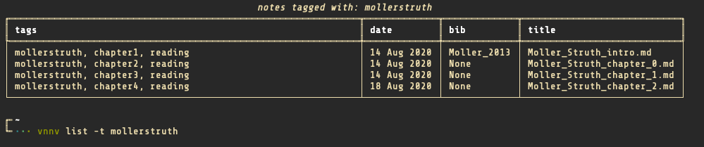

# vnnv - versatile notes in neovim

Under construction! Worked on it for only two weeks so far. Current aim is just
personal use, which is making organised notes, flashcards, and R/python
notebooks with one tool.

## The command line interface

Vnnv works by configuring one directory as your binder. In this directory you
store all you markdown files that have a vnnv specific preamble code block on
top that stores information about the file. A file in this directory with the
preamble can be found by vnnv and is called a note.

Here is the current docopt for the tool, it is still under construction!
```
Usage: vnnv [-h]
       vnnv add [-h]
       vnnv list [-h]  (-t TAGS ... )
       vnnv read [-hrl] (-t TAGS ..)
       vnnv anki [-h] ( -t TAGS ... )
       vnnv review [-h] ( -t TAGS ... )

options:
-h --help   show this, use after command to show specific help

commands:
add         not implemented yet
list        list notes based on tags or something else
read        read notes in latex or in html
anki        add flashcards in notes to anki
review      interactively select notes and review them one by one

```

## vnnv [commands]
### vnnv add

Currently not yet working, need to make a template and method in the binder
class to add a new note.

### vnnv list

Prints a pretty table of your notes, currently shows tags, date, bibfile, and
title of your note in different columns.
```
Usage: vnnv list [-h] (-t TAGS ... | -f FILES ... | -d DATES ...) [ -s KEY ]

    options:
    -h --help       show this help string of vnnv list
    -t TAGS ...     specify the tags to use as a query for notes to list. Tags
                    should be words or numbers sepparated by any number of
                    spaces.
    -d DATES ...    @todo: Implement query by a range of dates
    -s KEY ...      @todo: Implement a sort key that is based on tags. For
                    example a note with tags chapter1 is sorted before a note with tags
                    chapter2.
```

Screenshot after using `vnnv list -t [ TAGS ... ]`:


### vnnv read

Reads notes queried by tags in a specified format. Currently only latex and
Rmarkdown are working.
```
vnnv read [-hrl] (-t TAGS ... | -f FILES ... | -d DATES ...) [ -s KEY ]

    options:
    -h --help       show this help string of vnnv list

    -r              Read queried notes in Rmarkdown, for now be sure to query
                    only files with the .Rmd suffix. Markdown is converted
                    using the rmarkdown R package.

    -l              Read queried notes in latex. Markdown is converted using a
                    self-written regex parser (probably can break easily due to
                    my specific use case!)! The latex is written to a tempfile
                    on which pdflatex is called.

    -t TAGS ...     specify the tags to use as a query for notes to list. Tags
                    should be words or numbers sepparated by any number of
                    spaces.
    -d DATES ...    @todo: Implement query by a range of dates
    -f FILES ...    @todo: Implement opening with filename queries
    -s KEY ...      @todo: Implement a sort key that is based on tags. For
                    example a note with tags chapter1 is sorted before a note with tags
                    chapter2.
```

### vnnv anki

Anki reads notes for codeblocks with the .vnnv_anki language string. This is then
converted to a file that can be read by
[apy]. This allows to quickly
add flashcards to the flashcard program [anki].

```
vnnv anki [-h] ( -t TAGS ... )

    Reads the markdown notes based on the query option. The flashcard has to be
    in the following syntax:

    ~~~{.vnnv-anki}
    <question>
    My question
    </question>

    {{c1::
    <answer>My answer</answer>

    Some other lines.
    }}

    ## context
    For example: Book chapter 1 exercise 1
    ~~~

    The <question> and <answer> tags are to give some extra html styling to
    your card within the anki fields. The {{c1::.*}} pattern is the cloze
    deletion that will be hidden on the front of your card.

    options:
    -h --help       show this help string of vnnv list
    -t TAGS ...     specify the tags to use as a query for notes to list. Tags
                    should be words or numbers sepparated by any number of
                    spaces.
    -d DATES ...    @todo: Implement query by a range of dates
    -s KEY ...      @todo: Implement a sort key that is based on tags. For
                    example a note with tags chapter1 is sorted before a note with tags
                    chapter2.

```

### vnnv review

Review your notes interactively, very nice idea and code was adapted from [apy].
```
vnnv review [-h] ( -t TAGS ... )

    options:
    -h --help       show this help string of vnnv list
    -t TAGS ...     specify the tags to use as a query for notes to list. Tags
                    should be words or numbers sepparated by any number of
                    spaces.
    -d DATES ...    @todo: Implement query by a range of dates
    -f FILES ...    @todo: implement files query
    -s KEY ...      @todo: Implement a sort key that is based on tags. For
                    example a note with tags chapter1 is sorted before a note with tags
                    chapter2.
```

[apy]: https://github.com/lervag/apy/tree/master/apy
[anki]: https://apps.ankiweb.net
